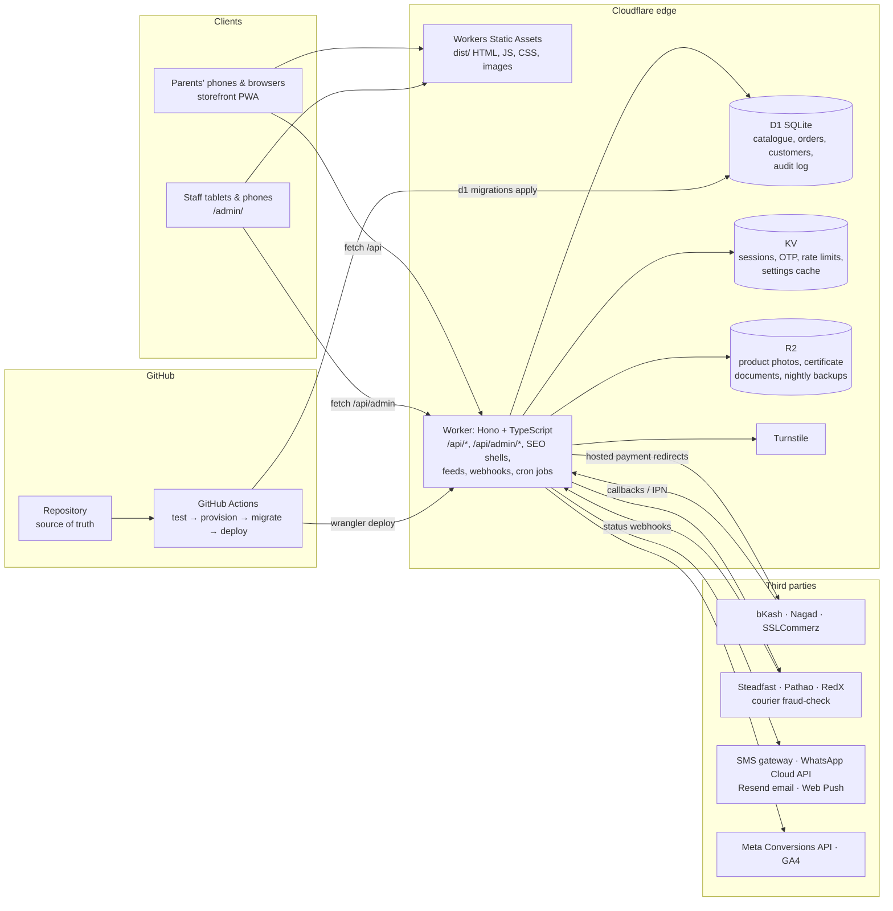
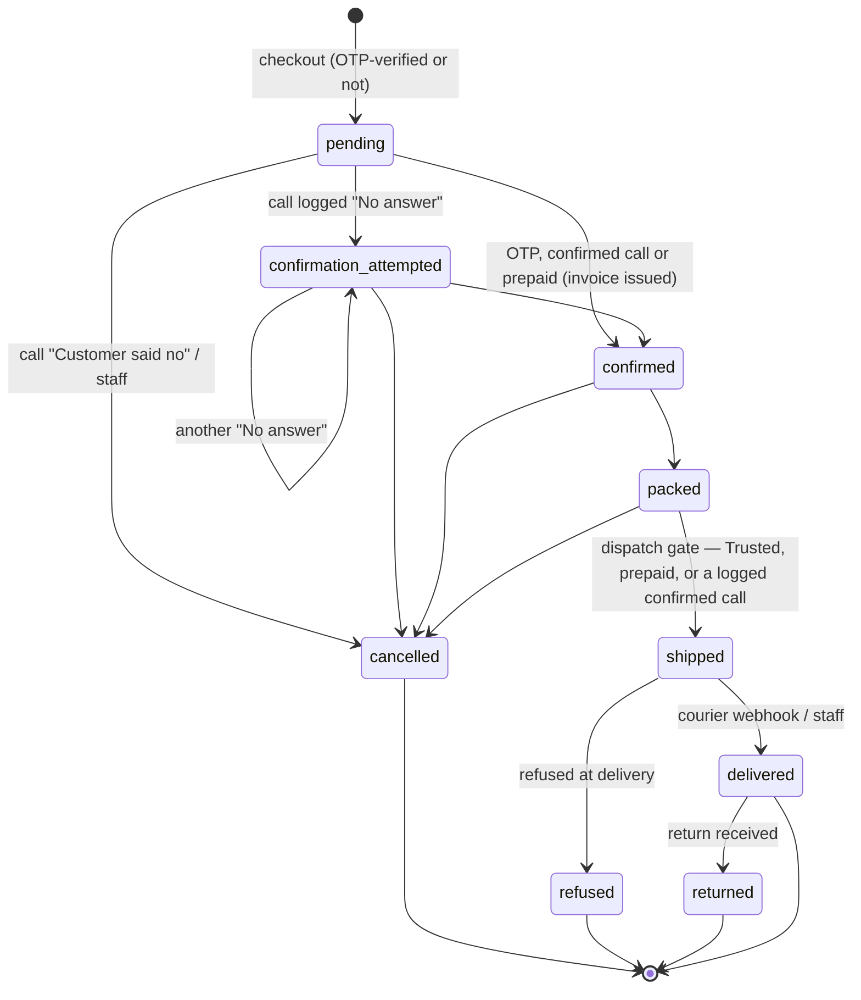
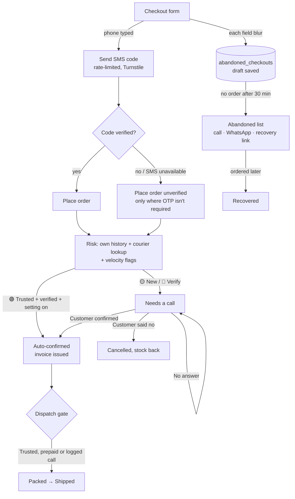

# Zamil Shop BD — A–Z Specification

This document describes the system as built in this repository, section by section in the order of the build brief
([BUILD-PROMPT.md](BUILD-PROMPT.md)). Items marked **ADJUSTABLE** are defaults to confirm with the owner.

**Contents:** [1 Brand](#1-brand-market--business-requirements) · [2 Storefront](#2-public-website--description--layout) ·
[3 Admin](#3-admin-dashboard--description--layout) · [4 Architecture](#4-full-stack-architecture) · [5 Data models](#5-data-models) ·
[6 Integrations](#6-payments-delivery--third-party-integrations) · [7 Security](#7-security--compliance) · [8 Testing](#8-testing-strategy) ·
[9 Dashboard plan](#9-dashboard-development-plan) · [10 Folders](#10-file--folder-structure) · [11 Setup](#11-development-environment--deployment-setup) ·
[12 SEO & marketing](#12-seo-performance--marketing) · [13 Catalogue](#13-product-categories--content-plan) · [14 Roadmap](#14-phased-roadmap) ·
[15 Conventions](#15-development--delivery-conventions) · [16 Fraud & abandoned checkouts](#16-fraud-prevention--abandoned-checkout-capture) ·
[17 Ads & tracking](#17-marketing-ads--conversion-tracking) · [18 Premium](#18-additional-premium-features) · [19 Acceptance](#19-acceptance-checklist) ·
[20 Owner operations](#20-owner-friendly-operations--onboarding) · [API reference](#api-reference) · [Glossary](#glossary) · [Assumptions](#assumptions)

---

## 1. Brand, Market & Business Requirements

| | |
|---|---|
| Brand | **Zamil Shop BD** / জামিল শপ বিডি |
| Tagline | *Little joys, safely delivered.* — ছোট্ট সোনামণির আনন্দ, নিরাপদে পৌঁছে দিই |
| Location | Dhaka, Bangladesh (**ADJUSTABLE** — `worker/src/brand.json`, Admin → Settings → Shop information) |
| Customers | New and expecting parents; relatives buying gifts for baby showers, aqiqah and birthdays |
| Business model | Cash on Delivery by default; bKash / Nagad / Rocket; cards via SSLCommerz |
| Logo direction | A rounded "Z" drawn in one stroke on a soft yellow blob, with small pink and mint dots — friendly, trustworthy, legible at 32 px (`public/img/logo.svg`) |

- **Bilingual everywhere.** Bangla is the default; a বাংলা / English toggle is in the storefront header and the admin profile menu. Product names, descriptions, messages and every admin label exist in both languages.
- **Plain language, large touch targets** (≥ 44 px) for a small non-technical team.
- **Location** appears on About/Contact, the footer and `LocalBusiness`/`Store` JSON-LD.
- **Certification integrity (hard rule).** A badge is shown only when a certification row exists **with a document**. Enforced three times: the admin form disables the badge until a file is attached; `certificationSchema` requires `document_url`; and the `certifications.document_url` column has `CHECK (length(trim(document_url)) > 0)`. The storefront only selects active, unexpired certifications (`VALID_CERT_SQL`). Seed data ships **no** certifications, reviews or sales counts.

## 2. Public Website — Description & Layout

**Style:** pastel palette (soft yellow `#FFE9A8`, mint `#C4EEDC`, lavender `#DED3F5`, peach `#FFD8C7`, plus sky and pink accents) on white/cream, rounded blob shapes, the rounded *Baloo Da 2* typeface (Bangla + Latin), a few simple illustrated accents.

| Page | Route | Notes |
|---|---|---|
| Home | `/` | hero banners, offer banner strip, category tiles, shop by age, marketing cards, new arrivals, best sellers (real `sold_count` only), gifting guide, approved reviews, newsletter |
| Shop / category | `/shop`, `/shop/:category`, `/search?q=` | filters: category, **age range**, price, brand, in stock, on sale; sort: newest, price, popularity, rating |
| Product | `/product/:slug` | gallery, age tags, size chart (clothing/shoes), material & care, documented certification badges, stock status ("only X left" only when real stock ≤ threshold), Add to cart / Buy now, reviews, related & upsell, back-in-stock "Notify me" |
| Cart / Checkout | `/cart`, `/checkout` | guest checkout; Division → District → Upazila/Thana; delivery charge auto-calculated from the area (or "Free delivery" for free-delivery products / a free-delivery coupon — no charge is shown); COD / bKash / Nagad / Rocket / card; SMS OTP; coupon or referral code; gift message; reorder-reminder opt-in |
| Order | `/order/:orderNo`, `/track` | status timeline, courier tracking, invoice PDF once confirmed |
| Account | `/account/(orders\|wishlist\|addresses\|registries\|returns\|referral\|reminders)` | order history & tracking, wishlist, saved addresses, gift registries, return requests, referral code, reminders |
| Gift registry | `/registry/:slug` | shareable list; guests buy items shipped to the parent |
| Gift finder | `/gift-finder` | pick age + budget; rule-based, optionally refined by Workers AI |
| Campaign page | `/lp/:slug` | nav-free: one hero, one offer, one button |
| Info | `/about`, `/contact`, `/size-guide`, `/policy/(returns\|delivery\|privacy)` | |

Address data comes from [bayeziddev/Bangladesh-geocode](https://github.com/bayeziddev/Bangladesh-geocode) (8 divisions, 64 districts, upazilas), supplemented with Dhaka and Chattogram city thanas (`scripts/build-geo.mjs` → `public/data/bd-geo.json`).

## 3. Admin Dashboard — Description & Layout

Cream background, pastel accents, rounded cards, gentle shadows, clear line icons — calmer than the storefront so staff can scan quickly.

```
┌──────────────┬──────────────────────────────────────┬──────────────────────┐
│ Left sidebar │ Work area                             │ Right rail           │
│ (collapsible)│  Dashboard: setup checklist,          │  Global search       │
│ Dashboard    │  Health Check, Needs your attention,  │  Profile menu        │
│ Orders  (7)  │  KPIs, monthly chart, recent orders,  │  Notifications bell  │
│ Abandoned    │  top sellers                          │  Staff online now    │
│ Returns …    │  Lists open detail in a slide-over    │                      │
└──────────────┴──────────────────────────────────────┴──────────────────────┘
```

On phones the sidebar and rail become drawers; tables become stacked cards.

| Module | What staff can do |
|---|---|
| Dashboard | first-run checklist, Health Check strip, "Needs your attention today", KPIs (today's orders & sales, month, cash still to collect, low stock, abandoned, active registries), monthly chart (Chart.js; numbers table if it can't load) |
| Orders | tabs incl. 📞 *Needs a call*; filters (payment, risk, date, warnings), CSV; bulk Confirm / Packed / Shipped with "You're about to mark 5 orders as Shipped — continue?"; detail with pipeline, gates, risk + reason, courier history, one-tap call / WhatsApp templates, call outcome buttons, ship dialog (Steadfast/Pathao booking or typed tracking ID), invoice PDF, shipping label, refunds, notes, messages log, Trash |
| Abandoned checkouts | to follow up / still filling in / recovered / not interested; call, WhatsApp, send recovery link; CSV |
| Returns & refunds | approve → item received (order becomes Returned, stock back) → refund sent; reject with reason; CSV |
| Products | list with stock health, badges, waiting count; editor: bilingual copy, category, brand, age ranges, price & discount, photos, variants with auto SKUs, certifications with documents, size chart, consumable + reorder days, gift flag, SEO; duplicate, Trash, CSV import/export, notify waiting |
| Categories | nested tree, drag to reorder / nest, SKU code per category; **New category** button; All / Active / Inactive tabs; one-tap Active ⇄ Inactive switch per row (sub-categories follow their parent, with a confirmation) — inactive categories are hidden from the shop menu, home tiles, category page and sitemap while their products stay on sale; CSV |
| Inventory | per-SKU stock, ±1/+5 and bulk set, reason, stock history, waiting list, CSV |
| Customers | order counts, 🟢/🟡/🔴 badge with reason, block/unblock, CSV |
| Coupons | flat/percent/free delivery, minimum order, expiry, usage limits, per-customer limit; recovery & referral coupons listed |
| Gift registries | progress, items, gift orders, share link, close/reopen |
| Reviews | approve / reject / reply |
| Campaign pages | landing pages for ads |
| Banners & logo | hero slider, offer banner, marketing cards and a once-per-visitor popup, each with image, colour, link and start/stop schedule; shop logo upload |
| Referrals | codes, uses, rewards, delivered revenue; switch off |
| Reports | sales by day/month/category/product/payment/zone/**ad campaign**, best sellers by SKU, delivery outcomes, best customers, checkout funnel — all CSV |
| Staff & roles | Super Admin, Manager, Order Processor, Read-only Viewer; phone for SMS sign-in; reset 2FA |
| Settings | shop info, payments, customer messages, WhatsApp quick replies, fake-order protection, abandoned checkouts, automatic messages, VAT, refer-a-friend, ads & tracking, connected services & backups |
| Delivery zones | fee, free-delivery threshold, ETA by division / district / upazila |
| Activity log | who did what, when, from where; CSV |

**CRUD rules:** slide-over forms, inline bilingual validation messages from the API, confirmation before delete (soft delete → Trash → restore), toasts for success/failure, actions hidden when the role lacks permission (and refused by the API anyway), search/filter/pagination on every list, loading / empty / error states on every view.

## 4. Full-Stack Architecture



- **Static first:** `run_worker_first` lists only dynamic paths (`/api/*`, `/media/*`, `/product/*`, `/shop/*`, feeds, `/wa`, `/registry/*`, `/lp/*`, sitemap, robots). Everything else is served from the edge without invoking the Worker.
- **SEO shells:** for `/product/:slug`, `/shop/:slug`, `/registry/:slug`, `/lp/:slug` the Worker streams `index.html` through `HTMLRewriter` to inject the title, meta description, canonical, Open Graph/Twitter tags and JSON-LD, then the SPA takes over.
- **Transactions:** D1 `batch()` is atomic — order + items + stock decrement + history are one batch; counters use `UPDATE … RETURNING`.
- **Cron:** `*/10 * * * *` — abandoned detection/recovery, retention purge, reorder reminders, review requests; `0 21 * * *` (03:00 Dhaka) — nightly backup to R2.

## 5. Data Models

`worker/migrations/0001_init.sql` creates 33 tables; `0002_delivery_and_banners.sql` adds `products.delivery_mode`, the `free_delivery` coupon type and the offer/marketing/popup banner placements; `0003_ride_on_toys.sql` adds the Ride-on Toys category, six products and their banners to an already-seeded database (a no-op on a fresh one, where the seed adds them). The tables below show the current schema. Money is stored as whole Taka (`INTEGER`),
timestamps as ISO-8601 UTC text, booleans as `0/1`. "Day" boundaries in reports and invoice numbers use Bangladesh time (UTC+6).

### SKU & invoice numbering (hard requirement)

| | Format | Example | How it's generated | Uniqueness |
|---|---|---|---|---|
| SKU (per variant) | `BBY-[CategoryCode]-[AgeRangeCode]-[Seq]` | `BBY-CLO-0-6M-0033` | on product save, blank SKUs get the next number from the `counters` row `sku:<CAT>`; age code is `0-6M`, `6-12M`, `1-3Y`, `3-5Y` or `ALL`; staff may type their own | `UNIQUE INDEX uq_variants_sku`; a clash returns a plain message ("This SKU is already used…") |
| Order number | `ZSB-YYMMDD-XXXX` | `ZSB-260930-Q58F` | at checkout (random suffix — not guessable from the previous order) | `UNIQUE` |
| Invoice number | `INV-BBY-YYYYMMDD-####` | `INV-BBY-20260930-0007` | **at confirmation** only; sequential per Bangladesh day via `counters` row `inv:YYYYMMDD` (`UPDATE … RETURNING`, atomic); idempotent — an order keeps its number | partial `UNIQUE INDEX` on `invoice_no` |

The PDF invoice (`GET /api/orders/:orderNo/invoice.pdf?token=…` for the customer, `GET /api/admin/orders/:id/invoice.pdf` for staff) lists SKU, item, size, quantity, unit price, line total, subtotal, discount (coupon/referral), delivery fee, optional VAT line with BIN, total, payment method and COD amount to collect.

### Worked example — the Order model

```ts
/** Order as returned by the admin API (camelCase view of the `orders` + `order_items` rows). */
type OrderStatus =
  | "pending" | "confirmation_attempted" | "confirmed" | "packed" | "shipped" | "delivered"
  | "cancelled"   // stopped before shipping
  | "refused"     // courier attempted delivery, customer declined
  | "returned";   // accepted, then sent back

interface OrderLineItem {
  sku: string;                 // e.g. "BBY-CLO-0-6M-0033" — copied onto the line so later edits never change history
  productId: number;
  variantId: number;
  nameEn: string;
  nameBn: string;
  size: string;                // "0–3 M", "Standard", …
  color: string;
  quantity: number;
  unitPrice: number;           // Taka, after product discount
  lineTotal: number;
}

interface Order {
  id: number;
  orderNo: string;             // "ZSB-260930-Q58F" — given at checkout
  invoiceNumber: string | null;// "INV-BBY-20260930-0007" — null until the order is confirmed
  status: OrderStatus;
  customer: { name: string; phone: string; email?: string };
  address: { division: string; district: string; upazila: string; area: string; zoneCode: string };
  items: OrderLineItem[];
  subtotal: number;
  discount: number;
  deliveryFee: number;
  vatAmount: number;           // 0 unless VAT is switched on in Settings
  total: number;
  couponCode?: string;
  referralCode?: string;
  paymentMethod: "COD" | "bKash" | "Nagad" | "Rocket" | "Card";
  paymentStatus: "pending" | "paid" | "failed" | "refunded" | "partially_refunded";
  paymentRef?: string;         // bKash/Nagad TrxID or gateway reference
  otpVerified: boolean;
  confirmationMethod?: "prepaid" | "call" | "otp" | "trusted";
  riskLevel: "low" | "medium" | "high"; // shown as 🟢 Trusted / 🟡 New / 🔴 Verify before shipping
  flags: ("velocity_phone" | "velocity_address" | "velocity_ip")[];
  courier?: { partner: "Steadfast" | "Pathao" | "RedX"; trackingId?: string; status?: string };
  utm?: { source?: string; medium?: string; campaign?: string };
  adRef?: string;              // click-to-WhatsApp / ad identifier
  createdAt: string;
  confirmedAt?: string;
  shippedAt?: string;
  deliveredAt?: string;
}
```

Response of `POST /api/orders` (fixture `tests/fixtures/create-order.response.json`):

```json
{
  "orderNo": "ZSB-260926-7K2Q",
  "status": "pending",
  "total": 1180,
  "purchaseEventId": "purchase-ZSB-260926-7K2Q",
  "items": [{ "sku": "BBY-CLO-0-6M-0001", "name": "Soft Cotton Romper", "quantity": 2, "price": 590 }]
}
```

### Order lifecycle



Stock goes back for **cancelled**, **refused** and **returned**. Only **refused** and **returned** count against a customer's risk.
Courier sub-statuses (e.g. *Out for delivery*) are stored in `courier_status` and shown to the customer without changing the main status.

### Tables

The tables the brief names (`products`, `product_variants`, `categories`, `orders`, `order_items`, `customers`, `addresses`,
`reviews`, `coupons`, `admins`, `inventory_log`, `registries`, `certifications`, `delivery_zones`) and those added for
sections 16–18 (`abandoned_checkouts`, `order_confirmation_attempts`, `return_requests`, `stock_notify_requests`,
`referral_codes`) are all below, generated from the migration.

#### `settings`

| Column | Type | Constraints / default | Notes |
|---|---|---|---|
| `key` | TEXT | PRIMARY KEY |  |
| `value` | TEXT | NOT NULL |  |
| `updated_at` | TEXT | NOT NULL DEFAULT (now) |  |

#### `counters`

| Column | Type | Constraints / default | Notes |
|---|---|---|---|
| `name` | TEXT | PRIMARY KEY |  |
| `value` | INTEGER | NOT NULL DEFAULT 0 |  |

#### `admins`

| Column | Type | Constraints / default | Notes |
|---|---|---|---|
| `id` | INTEGER | PRIMARY KEY AUTOINCREMENT |  |
| `name` | TEXT | NOT NULL |  |
| `email` | TEXT | NOT NULL UNIQUE | sign-in ID: email or simple username |
| `phone` | TEXT | UNIQUE | used for phone + OTP sign-in (staff roles) |
| `password_hash` | TEXT |  |  |
| `role` | TEXT | NOT NULL CHECK (role IN ('super_admin','manager','order_processor','viewer')) |  |
| `is_active` | INTEGER | NOT NULL DEFAULT 1 |  |
| `totp_secret` | TEXT |  | base32, set during 2FA setup |
| `totp_enabled` | INTEGER | NOT NULL DEFAULT 0 |  |
| `last_login_at` | TEXT |  |  |
| `last_seen_at` | TEXT |  |  |
| `created_at` | TEXT | NOT NULL DEFAULT (now) |  |
| `updated_at` | TEXT | NOT NULL DEFAULT (now) |  |
| `deleted_at` | TEXT |  |  |

#### `categories`

| Column | Type | Constraints / default | Notes |
|---|---|---|---|
| `id` | INTEGER | PRIMARY KEY AUTOINCREMENT |  |
| `parent_id` | INTEGER | REFERENCES categories(id) |  |
| `slug` | TEXT | NOT NULL UNIQUE |  |
| `code` | TEXT | NOT NULL | 3 letters used in SKUs, e.g. CLO, FED, DIA |
| `name_en` | TEXT | NOT NULL |  |
| `name_bn` | TEXT | NOT NULL |  |
| `description_en` | TEXT |  |  |
| `description_bn` | TEXT |  |  |
| `image_url` | TEXT |  |  |
| `color` | TEXT |  | pastel tile colour: yellow/mint/lavender/peach/sky/pink |
| `sort_order` | INTEGER | NOT NULL DEFAULT 0 |  |
| `is_active` | INTEGER | NOT NULL DEFAULT 1 |  |
| `created_at` | TEXT | NOT NULL DEFAULT (now) |  |
| `updated_at` | TEXT | NOT NULL DEFAULT (now) |  |
| `deleted_at` | TEXT |  |  |

index `idx_categories_parent` (parent_id, sort_order)

#### `products`

| Column | Type | Constraints / default | Notes |
|---|---|---|---|
| `id` | INTEGER | PRIMARY KEY AUTOINCREMENT |  |
| `slug` | TEXT | NOT NULL UNIQUE |  |
| `name_en` | TEXT | NOT NULL |  |
| `name_bn` | TEXT | NOT NULL |  |
| `description_en` | TEXT |  |  |
| `description_bn` | TEXT |  |  |
| `category_id` | INTEGER | REFERENCES categories(id) |  |
| `brand` | TEXT |  |  |
| `price` | INTEGER | NOT NULL CHECK (price > 0) |  |
| `sale_price` | INTEGER |  |  |
| `discount_type` | TEXT | NOT NULL DEFAULT 'none' CHECK (discount_type IN ('none','percent','flat')) |  |
| `discount_value` | INTEGER | NOT NULL DEFAULT 0 |  |
| `age_ranges` | TEXT | NOT NULL DEFAULT '' |  |
| `material_en` | TEXT |  |  |
| `material_bn` | TEXT |  |  |
| `care_en` | TEXT |  |  |
| `care_bn` | TEXT |  |  |
| `size_chart` | TEXT |  | 'clothing' / 'shoes' / NULL |
| `is_consumable` | INTEGER | NOT NULL DEFAULT 0 | diapers, wipes, formula … (reorder reminders) |
| `reorder_days` | INTEGER |  | typical days until a family needs more |
| `is_gift` | INTEGER | NOT NULL DEFAULT 0 | shows in the gifting guide |
| `tags` | TEXT | NOT NULL DEFAULT '' |  |
| `images` | TEXT | NOT NULL DEFAULT '[]' |  |
| `status` | TEXT | NOT NULL DEFAULT 'draft' CHECK (status IN ('draft','active','archived')) |  |
| `is_featured` | INTEGER | NOT NULL DEFAULT 0 |  |
| `delivery_mode` | TEXT | NOT NULL DEFAULT 'zone' CHECK (delivery_mode IN ('zone','free')) | 'zone' = charge from the customer's delivery zone; 'free' = ships free (a cart of only free-delivery items pays no delivery charge) |
| `sold_count` | INTEGER | NOT NULL DEFAULT 0 |  |
| `rating_avg` | REAL | NOT NULL DEFAULT 0 |  |
| `rating_count` | INTEGER | NOT NULL DEFAULT 0 |  |
| `meta_title` | TEXT |  |  |
| `meta_description` | TEXT |  |  |
| `created_at` | TEXT | NOT NULL DEFAULT (now) |  |
| `updated_at` | TEXT | NOT NULL DEFAULT (now) |  |
| `deleted_at` | TEXT |  |  |

index `idx_products_list` (status, deleted_at, category_id); index `idx_products_created` (created_at)

#### `product_variants`

| Column | Type | Constraints / default | Notes |
|---|---|---|---|
| `id` | INTEGER | PRIMARY KEY AUTOINCREMENT |  |
| `product_id` | INTEGER | NOT NULL REFERENCES products(id) ON DELETE CASCADE |  |
| `sku` | TEXT | NOT NULL |  |
| `size` | TEXT | NOT NULL DEFAULT 'Standard' |  |
| `color` | TEXT | NOT NULL DEFAULT '' |  |
| `age_range` | TEXT |  | 0-6m / 6-12m / 1-3y / 3-5y / NULL (all ages) |
| `stock` | INTEGER | NOT NULL DEFAULT 0 CHECK (stock >= 0) |  |
| `price_override` | INTEGER |  |  |
| `low_stock_threshold` | INTEGER | NOT NULL DEFAULT 3 |  |
| `sort_order` | INTEGER | NOT NULL DEFAULT 0 |  |
| `created_at` | TEXT | NOT NULL DEFAULT (now) |  |
| `updated_at` | TEXT | NOT NULL DEFAULT (now) |  |

unique index `uq_variants_sku` (sku); index `idx_variants_product` (product_id, sort_order)

#### `certifications`

| Column | Type | Constraints / default | Notes |
|---|---|---|---|
| `id` | INTEGER | PRIMARY KEY AUTOINCREMENT |  |
| `product_id` | INTEGER | NOT NULL REFERENCES products(id) ON DELETE CASCADE |  |
| `type` | TEXT | NOT NULL CHECK (type IN ('bpa_free','safety_tested','age_appropriate','non_toxic','organic_cotton','dermatologically_tested','bsti','ce','en71','astm_f963','oeko_tex')) |  |
| `issuer` | TEXT |  |  |
| `certificate_no` | TEXT |  |  |
| `document_url` | TEXT | NOT NULL CHECK (length(trim(document_url)) > 0) |  |
| `document_name` | TEXT |  |  |
| `valid_until` | TEXT |  |  |
| `is_active` | INTEGER | NOT NULL DEFAULT 1 |  |
| `added_by` | TEXT |  |  |
| `created_at` | TEXT | NOT NULL DEFAULT (now) |  |
| `updated_at` | TEXT | NOT NULL DEFAULT (now) |  |

unique index `uq_cert_product_type` (product_id, type)

#### `banners`

| Column | Type | Constraints / default | Notes |
|---|---|---|---|
| `id` | INTEGER | PRIMARY KEY AUTOINCREMENT |  |
| `placement` | TEXT | NOT NULL DEFAULT 'hero' CHECK (placement IN ('hero','offer','marketing','popup')) | hero slider · offer strip under the hero · marketing cards · popup (served in `/api/config`, shown once per visitor, never on cart/checkout) |
| `title_en` | TEXT | NOT NULL |  |
| `title_bn` | TEXT | NOT NULL |  |
| `subtitle_en` | TEXT |  |  |
| `subtitle_bn` | TEXT |  |  |
| `cta_en` | TEXT |  |  |
| `cta_bn` | TEXT |  |  |
| `link_url` | TEXT |  |  |
| `image_url` | TEXT |  |  |
| `color` | TEXT |  |  |
| `starts_at` | TEXT |  |  |
| `ends_at` | TEXT |  |  |
| `sort_order` | INTEGER | NOT NULL DEFAULT 0 |  |
| `is_active` | INTEGER | NOT NULL DEFAULT 1 |  |
| `created_at` | TEXT | NOT NULL DEFAULT (now) |  |
| `updated_at` | TEXT | NOT NULL DEFAULT (now) |  |
| `deleted_at` | TEXT |  |  |

#### `customers`

| Column | Type | Constraints / default | Notes |
|---|---|---|---|
| `id` | INTEGER | PRIMARY KEY AUTOINCREMENT |  |
| `name` | TEXT | NOT NULL |  |
| `phone` | TEXT | NOT NULL UNIQUE |  |
| `email` | TEXT |  |  |
| `password_hash` | TEXT |  |  |
| `is_blocked` | INTEGER | NOT NULL DEFAULT 0 |  |
| `notes` | TEXT |  |  |
| `total_orders` | INTEGER | NOT NULL DEFAULT 0 |  |
| `delivered_count` | INTEGER | NOT NULL DEFAULT 0 |  |
| `refused_or_returned_count` | INTEGER | NOT NULL DEFAULT 0 |  |
| `cancelled_count` | INTEGER | NOT NULL DEFAULT 0 |  |
| `risk_level` | TEXT | NOT NULL DEFAULT 'medium' CHECK (risk_level IN ('low','medium','high')) |  |
| `risk_reason` | TEXT |  |  |
| `phone_verified_at` | TEXT |  |  |
| `reminder_opt_in` | INTEGER | NOT NULL DEFAULT 0 |  |
| `referred_by_code` | TEXT |  |  |
| `last_login_at` | TEXT |  |  |
| `created_at` | TEXT | NOT NULL DEFAULT (now) |  |
| `updated_at` | TEXT | NOT NULL DEFAULT (now) |  |
| `deleted_at` | TEXT |  |  |

#### `addresses`

| Column | Type | Constraints / default | Notes |
|---|---|---|---|
| `id` | INTEGER | PRIMARY KEY AUTOINCREMENT |  |
| `customer_id` | INTEGER | NOT NULL REFERENCES customers(id) ON DELETE CASCADE |  |
| `label` | TEXT | NOT NULL DEFAULT 'Home' |  |
| `recipient_name` | TEXT | NOT NULL |  |
| `phone` | TEXT | NOT NULL |  |
| `division_id` | INTEGER | NOT NULL |  |
| `district_id` | INTEGER | NOT NULL |  |
| `upazila_id` | INTEGER | NOT NULL |  |
| `division` | TEXT | NOT NULL |  |
| `district` | TEXT | NOT NULL |  |
| `upazila` | TEXT | NOT NULL |  |
| `area` | TEXT | NOT NULL |  |
| `zone_code` | TEXT |  |  |
| `is_default` | INTEGER | NOT NULL DEFAULT 0 |  |
| `created_at` | TEXT | NOT NULL DEFAULT (now) |  |

index `idx_addresses_customer` (customer_id)

#### `wishlist`

| Column | Type | Constraints / default | Notes |
|---|---|---|---|
| `customer_id` | INTEGER | NOT NULL REFERENCES customers(id) ON DELETE CASCADE |  |
| `product_id` | INTEGER | NOT NULL REFERENCES products(id) ON DELETE CASCADE |  |
| `created_at` | TEXT | NOT NULL DEFAULT (now) |  |

`PRIMARY KEY (customer_id, product_id)`

#### `delivery_zones`

| Column | Type | Constraints / default | Notes |
|---|---|---|---|
| `id` | INTEGER | PRIMARY KEY AUTOINCREMENT |  |
| `code` | TEXT | NOT NULL UNIQUE |  |
| `name_en` | TEXT | NOT NULL |  |
| `name_bn` | TEXT | NOT NULL |  |
| `fee` | INTEGER | NOT NULL DEFAULT 0 |  |
| `free_shipping_min` | INTEGER |  |  |
| `division_ids` | TEXT | NOT NULL DEFAULT '[]' |  |
| `district_ids` | TEXT | NOT NULL DEFAULT '[]' |  |
| `upazila_ids` | TEXT | NOT NULL DEFAULT '[]' |  |
| `eta_en` | TEXT |  |  |
| `eta_bn` | TEXT |  |  |
| `is_default` | INTEGER | NOT NULL DEFAULT 0 |  |
| `is_active` | INTEGER | NOT NULL DEFAULT 1 |  |
| `sort_order` | INTEGER | NOT NULL DEFAULT 0 |  |
| `created_at` | TEXT | NOT NULL DEFAULT (now) |  |
| `updated_at` | TEXT | NOT NULL DEFAULT (now) |  |
| `deleted_at` | TEXT |  |  |

#### `coupons`

| Column | Type | Constraints / default | Notes |
|---|---|---|---|
| `id` | INTEGER | PRIMARY KEY AUTOINCREMENT |  |
| `code` | TEXT | NOT NULL UNIQUE COLLATE NOCASE |  |
| `description` | TEXT |  |  |
| `kind` | TEXT | NOT NULL DEFAULT 'standard' CHECK (kind IN ('standard','recovery','referral_reward')) |  |
| `type` | TEXT | NOT NULL CHECK (type IN ('percent','flat','free_delivery')) | free_delivery removes the delivery charge |
| `value` | INTEGER | NOT NULL DEFAULT 0 CHECK (value >= 0 AND (type = 'free_delivery' OR value > 0)) |  |
| `min_order` | INTEGER | NOT NULL DEFAULT 0 |  |
| `max_discount` | INTEGER |  |  |
| `starts_at` | TEXT |  |  |
| `expires_at` | TEXT |  |  |
| `usage_limit` | INTEGER |  |  |
| `per_customer_limit` | INTEGER |  |  |
| `used_count` | INTEGER | NOT NULL DEFAULT 0 |  |
| `category_ids` | TEXT | NOT NULL DEFAULT '[]' |  |
| `customer_phone` | TEXT |  | reserved for one customer (rewards/recovery) |
| `is_active` | INTEGER | NOT NULL DEFAULT 1 |  |
| `created_at` | TEXT | NOT NULL DEFAULT (now) |  |
| `updated_at` | TEXT | NOT NULL DEFAULT (now) |  |
| `deleted_at` | TEXT |  |  |

#### `referral_codes`

| Column | Type | Constraints / default | Notes |
|---|---|---|---|
| `id` | INTEGER | PRIMARY KEY AUTOINCREMENT |  |
| `code` | TEXT | NOT NULL UNIQUE COLLATE NOCASE |  |
| `customer_id` | INTEGER | NOT NULL REFERENCES customers(id) ON DELETE CASCADE |  |
| `uses` | INTEGER | NOT NULL DEFAULT 0 |  |
| `rewards_earned` | INTEGER | NOT NULL DEFAULT 0 | number of reward coupons issued |
| `reward` | INTEGER | NOT NULL DEFAULT 100 | Taka value of each reward coupon |
| `friend_discount` | INTEGER | NOT NULL DEFAULT 100 | Taka off the friend's first order |
| `is_active` | INTEGER | NOT NULL DEFAULT 1 |  |
| `created_at` | TEXT | NOT NULL DEFAULT (now) |  |

unique index `uq_referral_customer` (customer_id)

#### `landing_pages`

| Column | Type | Constraints / default | Notes |
|---|---|---|---|
| `id` | INTEGER | PRIMARY KEY AUTOINCREMENT |  |
| `slug` | TEXT | NOT NULL UNIQUE |  |
| `title_en` | TEXT | NOT NULL |  |
| `title_bn` | TEXT | NOT NULL |  |
| `subtitle_en` | TEXT |  |  |
| `subtitle_bn` | TEXT |  |  |
| `offer_en` | TEXT |  |  |
| `offer_bn` | TEXT |  |  |
| `image_url` | TEXT |  |  |
| `product_id` | INTEGER | REFERENCES products(id) |  |
| `coupon_code` | TEXT |  |  |
| `cta_en` | TEXT |  |  |
| `cta_bn` | TEXT |  |  |
| `color` | TEXT |  |  |
| `is_active` | INTEGER | NOT NULL DEFAULT 1 |  |
| `views` | INTEGER | NOT NULL DEFAULT 0 |  |
| `created_at` | TEXT | NOT NULL DEFAULT (now) |  |
| `updated_at` | TEXT | NOT NULL DEFAULT (now) |  |
| `deleted_at` | TEXT |  |  |

#### `registries`

| Column | Type | Constraints / default | Notes |
|---|---|---|---|
| `id` | INTEGER | PRIMARY KEY AUTOINCREMENT |  |
| `slug` | TEXT | NOT NULL UNIQUE | share link: /registry/<slug> |
| `customer_id` | INTEGER | NOT NULL REFERENCES customers(id) ON DELETE CASCADE |  |
| `title` | TEXT | NOT NULL |  |
| `event_type` | TEXT | NOT NULL DEFAULT 'baby_shower' CHECK (event_type IN ('baby_shower','birthday','aqiqah','welcome_baby','other')) |  |
| `event_date` | TEXT |  |  |
| `baby_name` | TEXT |  |  |
| `message` | TEXT |  |  |
| `ship_to_parent` | INTEGER | NOT NULL DEFAULT 1 |  |
| `address_id` | INTEGER | REFERENCES addresses(id) |  |
| `status` | TEXT | NOT NULL DEFAULT 'active' CHECK (status IN ('active','closed')) |  |
| `created_at` | TEXT | NOT NULL DEFAULT (now) |  |
| `updated_at` | TEXT | NOT NULL DEFAULT (now) |  |
| `deleted_at` | TEXT |  |  |

index `idx_registries_customer` (customer_id)

#### `registry_items`

| Column | Type | Constraints / default | Notes |
|---|---|---|---|
| `id` | INTEGER | PRIMARY KEY AUTOINCREMENT |  |
| `registry_id` | INTEGER | NOT NULL REFERENCES registries(id) ON DELETE CASCADE |  |
| `product_id` | INTEGER | NOT NULL REFERENCES products(id) |  |
| `variant_id` | INTEGER | REFERENCES product_variants(id) |  |
| `quantity_wanted` | INTEGER | NOT NULL DEFAULT 1 CHECK (quantity_wanted > 0) |  |
| `quantity_purchased` | INTEGER | NOT NULL DEFAULT 0 |  |
| `note` | TEXT |  |  |
| `created_at` | TEXT | NOT NULL DEFAULT (now) |  |

index `idx_registry_items` (registry_id)

#### `orders`

| Column | Type | Constraints / default | Notes |
|---|---|---|---|
| `id` | INTEGER | PRIMARY KEY AUTOINCREMENT |  |
| `order_no` | TEXT | NOT NULL UNIQUE |  |
| `invoice_no` | TEXT |  | INV-BBY-YYYYMMDD-#### set at confirmation |
| `public_token` | TEXT | NOT NULL |  |
| `session_id` | TEXT |  |  |
| `customer_id` | INTEGER | REFERENCES customers(id) |  |
| `customer_name` | TEXT | NOT NULL |  |
| `customer_phone` | TEXT | NOT NULL |  |
| `customer_email` | TEXT |  |  |
| `division_id` | INTEGER | NOT NULL |  |
| `district_id` | INTEGER | NOT NULL |  |
| `upazila_id` | INTEGER | NOT NULL |  |
| `division` | TEXT | NOT NULL |  |
| `district` | TEXT | NOT NULL |  |
| `upazila` | TEXT | NOT NULL |  |
| `area` | TEXT | NOT NULL |  |
| `zone_code` | TEXT | NOT NULL |  |
| `subtotal` | INTEGER | NOT NULL |  |
| `discount` | INTEGER | NOT NULL DEFAULT 0 |  |
| `delivery_fee` | INTEGER | NOT NULL DEFAULT 0 |  |
| `vat_amount` | INTEGER | NOT NULL DEFAULT 0 |  |
| `total` | INTEGER | NOT NULL |  |
| `coupon_code` | TEXT |  |  |
| `referral_code` | TEXT |  |  |
| `payment_method` | TEXT | NOT NULL CHECK (payment_method IN ('COD','bKash','Nagad','Rocket','Card')) |  |
| `payment_status` | TEXT | NOT NULL DEFAULT 'pending' CHECK (payment_status IN ('pending','paid','failed','refunded','partially_refunded')) |  |
| `payment_ref` | TEXT |  |  |
| `status` | TEXT | NOT NULL DEFAULT 'pending' CHECK (status IN ('pending','confirmation_attempted','confirmed','packed','shipped','delivered','cancelled','refused','returned')) |  |
| `courier_partner` | TEXT | CHECK (courier_partner IN ('Steadfast','Pathao','RedX')) |  |
| `tracking_id` | TEXT |  |  |
| `consignment_id` | TEXT |  |  |
| `courier_status` | TEXT |  | latest courier sub-status, e.g. out_for_delivery |
| `customer_note` | TEXT |  |  |
| `gift_message` | TEXT |  |  |
| `registry_id` | INTEGER | REFERENCES registries(id) |  |
| `lang` | TEXT | NOT NULL DEFAULT 'bn' |  |
| `admin_notes` | TEXT |  |  |
| `refund_amount` | INTEGER | NOT NULL DEFAULT 0 |  |
| `refund_note` | TEXT |  |  |
| `otp_verified` | INTEGER | NOT NULL DEFAULT 0 |  |
| `confirmation_method` | TEXT | CHECK (confirmation_method IN ('otp','call','trusted','prepaid','manual')) |  |
| `risk_level` | TEXT | NOT NULL DEFAULT 'medium' CHECK (risk_level IN ('low','medium','high')) |  |
| `risk_reasons` | TEXT | NOT NULL DEFAULT '[]' |  |
| `flags` | TEXT | NOT NULL DEFAULT '[]' | e.g. ["velocity_phone","velocity_ip"] |
| `fraud_check` | TEXT |  | courier phone-history lookup (JSON) |
| `ip` | TEXT |  |  |
| `utm_source` | TEXT |  |  |
| `utm_medium` | TEXT |  |  |
| `utm_campaign` | TEXT |  |  |
| `ad_ref` | TEXT |  | click-to-WhatsApp / ad identifier |
| `reminder_opt_in` | INTEGER | NOT NULL DEFAULT 0 |  |
| `confirmed_at` | TEXT |  |  |
| `shipped_at` | TEXT |  |  |
| `delivered_at` | TEXT |  |  |
| `review_requested_at` | TEXT |  |  |
| `created_at` | TEXT | NOT NULL DEFAULT (now) |  |
| `updated_at` | TEXT | NOT NULL DEFAULT (now) |  |
| `deleted_at` | TEXT |  |  |

unique index `uq_orders_invoice` (invoice_no) where invoice_no IS NOT NULL; index `idx_orders_status` (status, deleted_at, created_at); index `idx_orders_phone` (customer_phone, created_at); index `idx_orders_customer` (customer_id); index `idx_orders_created` (created_at); index `idx_orders_ip` (ip, created_at)

#### `order_items`

| Column | Type | Constraints / default | Notes |
|---|---|---|---|
| `id` | INTEGER | PRIMARY KEY AUTOINCREMENT |  |
| `order_id` | INTEGER | NOT NULL REFERENCES orders(id) ON DELETE CASCADE |  |
| `product_id` | INTEGER | REFERENCES products(id) |  |
| `variant_id` | INTEGER | REFERENCES product_variants(id) |  |
| `category_id` | INTEGER |  |  |
| `sku` | TEXT | NOT NULL |  |
| `name_en` | TEXT | NOT NULL |  |
| `name_bn` | TEXT | NOT NULL |  |
| `size` | TEXT |  |  |
| `color` | TEXT |  |  |
| `age_range` | TEXT |  |  |
| `image` | TEXT |  |  |
| `quantity` | INTEGER | NOT NULL CHECK (quantity > 0) |  |
| `unit_price` | INTEGER | NOT NULL |  |
| `line_total` | INTEGER | NOT NULL |  |
| `is_consumable` | INTEGER | NOT NULL DEFAULT 0 |  |
| `reorder_days` | INTEGER |  |  |

index `idx_order_items_order` (order_id); index `idx_order_items_product` (product_id)

#### `order_status_history`

| Column | Type | Constraints / default | Notes |
|---|---|---|---|
| `id` | INTEGER | PRIMARY KEY AUTOINCREMENT |  |
| `order_id` | INTEGER | NOT NULL REFERENCES orders(id) ON DELETE CASCADE |  |
| `status` | TEXT | NOT NULL |  |
| `note` | TEXT |  |  |
| `actor` | TEXT | NOT NULL |  |
| `created_at` | TEXT | NOT NULL DEFAULT (now) |  |

index `idx_history_order` (order_id)

#### `order_confirmation_attempts`

| Column | Type | Constraints / default | Notes |
|---|---|---|---|
| `id` | INTEGER | PRIMARY KEY AUTOINCREMENT |  |
| `order_id` | INTEGER | NOT NULL REFERENCES orders(id) ON DELETE CASCADE |  |
| `attempted_at` | TEXT | NOT NULL DEFAULT (now) |  |
| `method` | TEXT | NOT NULL DEFAULT 'call' CHECK (method IN ('call','whatsapp','sms')) |  |
| `outcome` | TEXT | NOT NULL CHECK (outcome IN ('no_answer','confirmed','declined')) |  |
| `note` | TEXT |  |  |
| `staff_id` | INTEGER | REFERENCES admins(id) |  |
| `staff_name` | TEXT | NOT NULL |  |

index `idx_attempts_order` (order_id)

#### `return_requests`

| Column | Type | Constraints / default | Notes |
|---|---|---|---|
| `id` | INTEGER | PRIMARY KEY AUTOINCREMENT |  |
| `order_id` | INTEGER | NOT NULL REFERENCES orders(id) ON DELETE CASCADE |  |
| `customer_id` | INTEGER | REFERENCES customers(id) |  |
| `reason` | TEXT | NOT NULL CHECK (reason IN ('wrong_size','damaged','wrong_item','not_as_described','changed_mind','other')) |  |
| `details` | TEXT |  |  |
| `status` | TEXT | NOT NULL DEFAULT 'requested' CHECK (status IN ('requested','approved','rejected','received','refunded')) |  |
| `refund_amount` | INTEGER | NOT NULL DEFAULT 0 |  |
| `refund_method` | TEXT |  |  |
| `admin_note` | TEXT |  |  |
| `created_at` | TEXT | NOT NULL DEFAULT (now) |  |
| `updated_at` | TEXT | NOT NULL DEFAULT (now) |  |

index `idx_returns_order` (order_id)

#### `abandoned_checkouts`

| Column | Type | Constraints / default | Notes |
|---|---|---|---|
| `id` | INTEGER | PRIMARY KEY AUTOINCREMENT |  |
| `session_id` | TEXT | NOT NULL UNIQUE |  |
| `name` | TEXT |  |  |
| `phone` | TEXT |  |  |
| `email` | TEXT |  |  |
| `division` | TEXT |  |  |
| `district` | TEXT |  |  |
| `upazila` | TEXT |  |  |
| `area` | TEXT |  |  |
| `cart` | TEXT | NOT NULL DEFAULT '[]' | snapshot: [{variantId, sku, name_en, name_bn, quantity, unitPrice}] |
| `cart_total` | INTEGER | NOT NULL DEFAULT 0 |  |
| `last_step` | TEXT | NOT NULL DEFAULT 'contact' CHECK (last_step IN ('cart','contact','address','payment')) |  |
| `status` | TEXT | NOT NULL DEFAULT 'open' CHECK (status IN ('open','converted','recovered','ignored')) |  |
| `order_id` | INTEGER | REFERENCES orders(id) |  |
| `contact_attempts` | INTEGER | NOT NULL DEFAULT 0 |  |
| `last_contacted_at` | TEXT |  |  |
| `recovery_sent_at` | TEXT |  |  |
| `lead_sent_at` | TEXT |  |  |
| `utm_source` | TEXT |  |  |
| `utm_medium` | TEXT |  |  |
| `utm_campaign` | TEXT |  |  |
| `ip` | TEXT |  |  |
| `lang` | TEXT | NOT NULL DEFAULT 'bn' |  |
| `created_at` | TEXT | NOT NULL DEFAULT (now) |  |
| `updated_at` | TEXT | NOT NULL DEFAULT (now) |  |

index `idx_abandoned_status` (status, updated_at); index `idx_abandoned_phone` (phone)

#### `reviews`

| Column | Type | Constraints / default | Notes |
|---|---|---|---|
| `id` | INTEGER | PRIMARY KEY AUTOINCREMENT |  |
| `product_id` | INTEGER | NOT NULL REFERENCES products(id) ON DELETE CASCADE |  |
| `order_id` | INTEGER | REFERENCES orders(id) |  |
| `customer_id` | INTEGER | REFERENCES customers(id) |  |
| `name` | TEXT | NOT NULL |  |
| `rating` | INTEGER | NOT NULL CHECK (rating BETWEEN 1 AND 5) |  |
| `body` | TEXT | NOT NULL |  |
| `status` | TEXT | NOT NULL DEFAULT 'pending' CHECK (status IN ('pending','approved','rejected')) |  |
| `verified_purchase` | INTEGER | NOT NULL DEFAULT 0 |  |
| `reply` | TEXT |  |  |
| `replied_by` | TEXT |  |  |
| `created_at` | TEXT | NOT NULL DEFAULT (now) |  |
| `updated_at` | TEXT | NOT NULL DEFAULT (now) |  |
| `deleted_at` | TEXT |  |  |

index `idx_reviews_product` (product_id, status)

#### `inventory_log`

| Column | Type | Constraints / default | Notes |
|---|---|---|---|
| `id` | INTEGER | PRIMARY KEY AUTOINCREMENT |  |
| `product_id` | INTEGER |  |  |
| `variant_id` | INTEGER |  |  |
| `sku` | TEXT |  |  |
| `change` | INTEGER | NOT NULL |  |
| `stock_after` | INTEGER |  |  |
| `reason` | TEXT | NOT NULL CHECK (reason IN ('initial','order','cancel','refused','return','restock','adjustment','import')) |  |
| `note` | TEXT |  |  |
| `actor` | TEXT | NOT NULL |  |
| `created_at` | TEXT | NOT NULL DEFAULT (now) |  |

index `idx_inventory_variant` (variant_id, created_at)

#### `stock_notify_requests`

| Column | Type | Constraints / default | Notes |
|---|---|---|---|
| `id` | INTEGER | PRIMARY KEY AUTOINCREMENT |  |
| `product_id` | INTEGER | NOT NULL REFERENCES products(id) ON DELETE CASCADE |  |
| `variant_id` | INTEGER | REFERENCES product_variants(id) ON DELETE CASCADE |  |
| `phone` | TEXT |  |  |
| `email` | TEXT |  |  |
| `lang` | TEXT | NOT NULL DEFAULT 'bn' |  |
| `created_at` | TEXT | NOT NULL DEFAULT (now) |  |
| `notified_at` | TEXT |  |  |

`CHECK (phone IS NOT NULL OR email IS NOT NULL)`; index `idx_stock_notify` (product_id, notified_at)

#### `reorder_reminders`

| Column | Type | Constraints / default | Notes |
|---|---|---|---|
| `id` | INTEGER | PRIMARY KEY AUTOINCREMENT |  |
| `order_id` | INTEGER | NOT NULL REFERENCES orders(id) ON DELETE CASCADE |  |
| `phone` | TEXT | NOT NULL |  |
| `product_id` | INTEGER | NOT NULL |  |
| `variant_id` | INTEGER |  |  |
| `name_en` | TEXT | NOT NULL |  |
| `name_bn` | TEXT | NOT NULL |  |
| `lang` | TEXT | NOT NULL DEFAULT 'bn' |  |
| `due_at` | TEXT | NOT NULL |  |
| `status` | TEXT | NOT NULL DEFAULT 'scheduled' CHECK (status IN ('scheduled','sent','cancelled')) |  |
| `sent_at` | TEXT |  |  |
| `created_at` | TEXT | NOT NULL DEFAULT (now) |  |

index `idx_reminders_due` (status, due_at)

#### `newsletter_subscribers`

| Column | Type | Constraints / default | Notes |
|---|---|---|---|
| `id` | INTEGER | PRIMARY KEY AUTOINCREMENT |  |
| `contact` | TEXT | NOT NULL UNIQUE | email or mobile number |
| `lang` | TEXT | NOT NULL DEFAULT 'bn' |  |
| `created_at` | TEXT | NOT NULL DEFAULT (now) |  |

#### `notifications`

| Column | Type | Constraints / default | Notes |
|---|---|---|---|
| `id` | INTEGER | PRIMARY KEY AUTOINCREMENT |  |
| `channel` | TEXT | NOT NULL CHECK (channel IN ('sms','whatsapp','email','push')) |  |
| `recipient` | TEXT | NOT NULL |  |
| `template` | TEXT | NOT NULL |  |
| `message` | TEXT | NOT NULL |  |
| `status` | TEXT | NOT NULL CHECK (status IN ('sent','failed','skipped')) |  |
| `error` | TEXT |  |  |
| `order_id` | INTEGER |  |  |
| `created_at` | TEXT | NOT NULL DEFAULT (now) |  |

index `idx_notifications_order` (order_id); index `idx_notifications_created` (created_at)

#### `marketing_events`

| Column | Type | Constraints / default | Notes |
|---|---|---|---|
| `id` | INTEGER | PRIMARY KEY AUTOINCREMENT |  |
| `provider` | TEXT | NOT NULL | meta_capi / ga4_mp |
| `event_name` | TEXT | NOT NULL |  |
| `event_id` | TEXT | NOT NULL |  |
| `status` | TEXT | NOT NULL CHECK (status IN ('sent','failed','skipped')) |  |
| `error` | TEXT |  |  |
| `created_at` | TEXT | NOT NULL DEFAULT (now) |  |

index `idx_marketing_created` (created_at)

#### `wa_leads`

| Column | Type | Constraints / default | Notes |
|---|---|---|---|
| `id` | INTEGER | PRIMARY KEY AUTOINCREMENT |  |
| `phone` | TEXT |  |  |
| `ad_ref` | TEXT | NOT NULL |  |
| `ctwa_clid` | TEXT |  |  |
| `headline` | TEXT |  |  |
| `source_url` | TEXT |  |  |
| `first_text` | TEXT |  |  |
| `created_at` | TEXT | NOT NULL DEFAULT (now) |  |

index `idx_wa_leads_phone` (phone, created_at)

#### `push_subscriptions`

| Column | Type | Constraints / default | Notes |
|---|---|---|---|
| `id` | INTEGER | PRIMARY KEY AUTOINCREMENT |  |
| `endpoint` | TEXT | NOT NULL UNIQUE |  |
| `p256dh` | TEXT |  |  |
| `auth` | TEXT |  |  |
| `phone` | TEXT |  |  |
| `customer_id` | INTEGER |  |  |
| `promo_opt_in` | INTEGER | NOT NULL DEFAULT 0 |  |
| `last_message` | TEXT |  | JSON {title, body, url}; the service worker fetches it |
| `created_at` | TEXT | NOT NULL DEFAULT (now) |  |

index `idx_push_phone` (phone)

#### `audit_log`

| Column | Type | Constraints / default | Notes |
|---|---|---|---|
| `id` | INTEGER | PRIMARY KEY AUTOINCREMENT |  |
| `admin_id` | INTEGER |  |  |
| `admin_name` | TEXT | NOT NULL |  |
| `action` | TEXT | NOT NULL |  |
| `entity` | TEXT | NOT NULL |  |
| `entity_id` | TEXT |  |  |
| `details` | TEXT |  |  |
| `ip` | TEXT |  |  |
| `created_at` | TEXT | NOT NULL DEFAULT (now) |  |

index `idx_audit_created` (created_at); index `idx_audit_entity` (entity, entity_id)


## 6. Payments, Delivery & Third-Party Integrations

Every integration is optional: without its secret the feature degrades gracefully and the Health Check strip says so in plain words.

| Area | Provider | How it works | Secrets |
|---|---|---|---|
| Cash on Delivery | — | default, always available | — |
| bKash | manual or Tokenized Checkout API | manual: customer sends money and types the TrxID; staff verify ("Mobile payments to check" on the dashboard). API: hosted redirect → `/api/payments/bkash/callback` → execute & verify | `BKASH_APP_KEY`, `BKASH_APP_SECRET`, `BKASH_USERNAME`, `BKASH_PASSWORD`, `BKASH_BASE_URL` |
| Nagad / Rocket | manual (Nagad API keys reserved) | TrxID flow as above | `NAGAD_*` |
| Cards | SSLCommerz hosted page | redirect → IPN `/api/payments/sslcommerz/ipn` validated server-side; card data never touches the Worker | `SSLCZ_STORE_ID`, `SSLCZ_STORE_PASSWD`, `SSLCZ_SANDBOX` |
| Courier | Steadfast (primary) | consignment booked from the Ship dialog; webhook `/api/webhooks/steadfast` updates status incl. delivered / cancelled / out for delivery | `STEADFAST_API_KEY`, `STEADFAST_SECRET_KEY`, `STEADFAST_WEBHOOK_TOKEN` |
| Courier | Pathao | order booking + webhook `/api/webhooks/pathao` (shared-secret signature header, constant-time compare) | `PATHAO_*` |
| Courier | RedX | tracking ID typed by staff; tracking link shown | `REDX_API_TOKEN` (reserved) |
| Fraud check | any courier-history lookup | phone → total / delivered / returned parcels, cached 24 h | `FRAUD_CHECK_API_URL`, `FRAUD_CHECK_API_KEY` |
| SMS | any HTTP SMS gateway (BulkSMSBD-style) | OTP, order updates, reminders | `SMS_API_URL`, `SMS_API_KEY`, `SMS_SENDER_ID` |
| WhatsApp | Cloud API | template messages; inbound webhook captures `[ref:…]` for ad attribution | `WHATSAPP_TOKEN`, `WHATSAPP_PHONE_ID`, `WHATSAPP_VERIFY_TOKEN`, `WHATSAPP_APP_SECRET` |
| Email | Resend | order emails, back-in-stock | `RESEND_API_KEY`, `EMAIL_FROM` |
| Web push | VAPID (no-payload push) | order-status and promo pushes for installed PWA | `VAPID_PUBLIC_KEY`, `VAPID_PRIVATE_KEY`, `VAPID_SUBJECT` |
| AI (optional) | Workers AI | gift-finder refinement, bilingual description drafts (never allowed to claim certifications) | `[ai]` binding in `wrangler.toml` |

**Delivery fee:** `delivery_zones` rules are matched most-specific-first — upazila → district → division → default — with a free-delivery threshold and ETA per zone. The checkout shows the fee live as the address is chosen (`GET /api/delivery-fee`), and the server recomputes it at order time. No charge applies — and none is shown — when every item in the cart is a free-delivery product (`products.delivery_mode = 'free'`, set per product in Admin → Products) or a free-delivery coupon is applied; the quote's `freeDelivery` field says why (`products`, `coupon` or `threshold`).

## 7. Security & Compliance

Summary (full detail, NIST CSF mapping, incident response and backup/restore in **[SECURITY.md](SECURITY.md)**):

- Passwords: PBKDF2-SHA-256, 100 000 iterations, per-user salt. Admin 2FA (TOTP, RFC 6238) **required** for Super Admin and Manager; staff roles may use phone + SMS code instead of a password.
- Sessions: random 256-bit tokens in `HttpOnly; Secure; SameSite=Strict` cookies, stored in KV (admin 12 h, customer 30 days); deactivating a staff account revokes live sessions.
- CSRF: state-changing requests need `X-Requested-With` and a same-origin `Origin`.
- RBAC on every admin route (`perm()` middleware) — the UI hiding a button is convenience, not the control.
- HTTPS/HSTS (production), CSP, `X-Frame-Options: DENY`, `Referrer-Policy`, `Permissions-Policy`.
- Rate limits (KV) on sign-in, OTP send/verify, checkout, drafts, reviews, tracking, invoices.
- PCI scope minimised: card payments only via SSLCommerz's hosted page; MFS via hosted redirects.
- Secrets only as Wrangler/GitHub secrets; the settings API rejects keys that look like secrets.
- Audit log for every admin write, export, sign-in and failed sign-in.
- Personal-data minimisation: abandoned-checkout data deleted after the retention period; CAPI user data SHA-256 hashed.
- CSV exports neutralise spreadsheet formulas (`=`, `+`, `-`, `@` prefixes).
- Certification integrity (section 1) enforced in UI, API and database.

## 8. Testing Strategy

| Layer | Tool | Where | What |
|---|---|---|---|
| Unit | Vitest (`@cloudflare/vitest-pool-workers`) | `tests/unit/` | SKU & invoice formats and sequences, delivery-zone matching, pricing & coupons, VAT, risk scoring & gates, CSV escaping, TOTP, phone normalisation |
| Integration | Vitest in the Workers runtime with local D1/KV/R2 | `tests/integration/` | catalogue & age filter, checkout with OTP, COD confirm gate, dispatch gate, trusted fast lane, velocity flags, invoice issue + PDF, abandoned capture/recovery, returns, admin sign-in + 2FA, RBAC, **certification cannot be saved without a document** (API and DB constraint), CSV exports |
| E2E | Playwright (Pixel 5 + desktop Chrome) | `tests/e2e/` | parent filters by age → cart → checkout with SMS code → order page → staff confirm → invoice; abandoned-checkout autosave; staff phone sign-in → *Needs a call* → log "Customer confirmed" → invoice number shown |
| Fixtures | JSON | `tests/fixtures/` | product-list, create-order (request/response), admin-login (request/response), validation error |
| Build gate | `tsc --noEmit` | CI | runs before tests and again before deploy |

Current result: **80 Vitest tests** and **6 Playwright runs** (3 scenarios × 2 devices) pass.

## 9. Dashboard Development Plan

- Vanilla ES modules, no framework or build step for the admin (`admin/js`); one `html` tagged template auto-escapes every value.
- Chart.js 4 loaded from jsDelivr only on the dashboard; if it can't load, the same numbers render as a table.
- Every list uses `listTable()` with skeleton loading, empty and error (with *Try again*) states.
- Designed for tablets and large phones first: stacked cards instead of tables under 760 px, drawer navigation, 44 px targets.
- Bangla by default, English toggle remembered per device.

## 10. File & Folder Structure

```
babyshop/
├── worker/
│   ├── src/
│   │   ├── routes/
│   │   │   ├── public.ts        catalogue, home, reviews, stock-notify, newsletter, events, gift finder, registries, landing pages, push
│   │   │   ├── checkout.ts      delivery fee, cart quote, checkout drafts, OTP, orders, tracking, invoice PDF
│   │   │   ├── customer.ts      customer auth and /me (orders, addresses, wishlist, registries, returns, referral, reminders)
│   │   │   ├── callbacks.ts     payment callbacks and courier / WhatsApp webhooks
│   │   │   ├── seo.ts           robots, sitemap, product feeds, /wa redirect, SEO shells, /media
│   │   │   └── admin/           auth (2FA, phone OTP), orders, products, insights & reports, system, ops, generic CRUD
│   │   ├── lib/                 payments, couriers, notify (SMS/WhatsApp/email), push, marketing (CAPI), sku + invoice,
│   │   │                        risk, pricing, orders (state machine), pdf, invoice, csv, schemas (zod), rbac, settings
│   │   ├── brand.json           brand name, colours, prefixes, contact placeholders
│   │   ├── jobs.ts              cron jobs (recovery, reminders, review requests, purge, backup)
│   │   ├── middleware.ts        security headers, CSRF, language, sessions, RBAC
│   │   └── index.ts
│   ├── migrations/0001_init.sql, 0002_delivery_and_banners.sql, 0003_ride_on_toys.sql
│   ├── .dev.vars.example
│   └── wrangler.toml
├── public/                      storefront (index.html, css/, js/ + views/, sw.js, img/, data/bd-geo.json)
├── admin/                       admin SPA (index.html, css/, js/ + views/)
├── scripts/                     build, seed data, generated art, ride-on toy renders, geo data, create-admin, provision, sync-secrets
├── tests/                       unit/, integration/, e2e/, fixtures/
├── .github/workflows/ci.yml, deploy.yml, doctor.yml
└── docs/                        SPECIFICATION.md, SETUP.md, SECURITY.md, BUILD-PROMPT.md
```

## 11. Development Environment & Deployment Setup

Node.js 22 (20+), Wrangler 4 (project dependency — `npx wrangler`), a free Cloudflare account, a GitHub repository.
Branches: feature branches → pull request (CI runs all tests) → merge to `main` (CI deploys). Full step-by-step,
including `wrangler d1 create`, KV and R2, `.dev.vars`, GitHub secrets and custom domain: **[SETUP.md](SETUP.md)**.

## 12. SEO, Performance & Marketing

- Per-page `<title>`, meta description, canonical, `hreflang` (bn/en), Open Graph and Twitter cards — injected at the edge for product, category, registry and landing pages.
- JSON-LD: `Store` with the Dhaka address (every page), `Product` + `Offer` with shipping details and age audience (+ `AggregateRating` only when approved reviews exist), `BreadcrumbList`, `ItemList` on category pages.
- `sitemap.xml` (products, categories, pages) and `robots.txt` (admin, API, account, checkout and order pages disallowed).
- Feeds: `/feeds/google.xml` (Google Merchant Center), `/feeds/facebook.xml` (Facebook/Instagram Shop catalogue).
- WhatsApp click-to-chat: floating button → `/wa` builds a pre-filled message and carries `?ref=` into the chat as `[ref:…]`.
- Performance targets on a mid-range Android over 4G: LCP < 2.5 s, INP < 200 ms, CLS < 0.1. Static assets from the edge; images WebP, lazy-loaded with fixed dimensions; admin uploads are resized in the browser to ≤ 1600 px WebP; JS and CSS cached 10 minutes, with cache-busting build IDs.

## 13. Product Categories & Content Plan

| Category (code) | Sub-categories | Seed examples |
|---|---|---|
| Baby Clothing (CLO) | Rompers & Onesies, Sets & Dresses | Soft Cotton Romper, Newborn 5-Piece Clothing Set, Cotton Frock with Bloomer, Muslin Swaddle Wraps |
| Feeding & Nursing (FED) | — | Wide-Neck Feeding Bottle 250 ml, Silicone Bibs (2-pack) |
| Diapers & Wipes (DIA) | — | Diaper Pants (40), Gentle Water Wipes (3-pack) — consumables with reorder reminders |
| Toys & Learning (TOY) | Soft Toys, Learning Toys | Plush Teddy Bear, Wooden Stacking Rings, Musical Activity Cube, Bangla & English Alphabet Puzzle Mat |
| Nursery & Bedding (NUR) | — | Cotton Crib Bedding Set, Foldable Baby Mosquito Net |
| Bath & Skincare (BTH) | — | Baby Bath Tub, Gentle Baby Shampoo 200 ml, Hooded Bath Towel |
| Gift Sets (GFT) | — | Welcome Baby Gift Hamper, First Birthday Gift Box |

All **ADJUSTABLE**. Content plan: real photos on a plain light background (1:1, ≥ 1200 px), a two-line bilingual description,
material and care, honest sizing (size chart), and certificates only when held.

## 14. Phased Roadmap

| Phase | Scope | Status in this repository |
|---|---|---|
| 1 — MVP | catalogue, cart, COD checkout, admin CRUD for products/orders/categories, SKU + invoice generation | built |
| 2 | bKash/Nagad/SSLCommerz, Steadfast API, coupons, reviews, reorder reminders, reports | built (integrations switch on when their secrets are added) |
| 3 | gift registry, AI gift recommender, PWA/offline, referral | built; AI is opt-in (`[ai]` binding). A points-based loyalty programme is the remaining Phase 3 item |

## 15. Development & Delivery Conventions

Complete files (no diffs) in commits; `tsc --noEmit` and the test suites must pass before merge and before deploy;
all copy bilingual and plain-language; every admin write is audited; new tables arrive as new numbered migrations
(never edit an applied migration).

## 16. Fraud Prevention & Abandoned-Checkout Capture



- **OTP:** `POST /api/otp/send` → `POST /api/otp/verify` returns a short-lived token submitted with the order; 4 codes per phone per hour, 10 per IP.
- **Courier lookup:** when an order is opened (cached 24 h, "Check again" button).
- **Risk score** (plain badge + one-line reason): 🔴 if blocked, ≥ 2 refused/returned, refusals ≥ half of deliveries, or courier acceptance < 60 % over ≥ 3 parcels; 🟢 when delivered ≥ 3 (**ADJUSTABLE**) and never refused; otherwise 🟡.
- **Gates:** *confirm* needs prepaid, a logged "Customer confirmed" call, or OTP; *dispatch* needs prepaid, a logged confirmed call, or 🟢 + OTP.
- **Velocity:** repeated orders from the same phone / address / IP inside the window add warning flags shown on the order.
- **Turnstile** on checkout, SMS-code requests, customer sign-in/registration and staff sign-in when `TURNSTILE_SECRET` is set.
- **Abandoned checkouts:** drafts autosaved on blur (debounced), matched to a session; shown after 30 min with contact, cart, last step, time; actions *Call*, *WhatsApp*, *Send recovery message*, *Recovered*, *Not interested*; purged after 30 days (**ADJUSTABLE**).

## 17. Marketing, Ads & Conversion Tracking

| Event | Browser (Pixel / GA4) | Server (Meta CAPI) | Shared `event_id` |
|---|---|---|---|
| PageView / page_view | ✓ | ✓ (via `/api/events`) | ✓ |
| ViewContent / view_item | ✓ | ✓ | ✓ |
| AddToCart / add_to_cart | ✓ | ✓ | ✓ |
| InitiateCheckout / begin_checkout | ✓ | ✓ | ✓ |
| Lead / generate_lead (abandoned capture) | ✓ | ✓ when the draft first gets a phone | `lead-<session>` |
| Purchase / purchase | ✓ on the order page | ✓ at the moment the order is created | `purchase-<orderNo>` |

- CAPI sends SHA-256-hashed phone (E.164 `880…`), email, external id, plus IP, user agent, `fbp`/`fbc`; `META_TEST_EVENT_CODE` for testing. Failures are logged in `marketing_events` and counted on the Health Check strip.
- Google Ads conversion (`googleAdsId` + label) fires on the order page; GA4 uses the standard e-commerce schema; Microsoft Clarity loads when its ID is set.
- UTM parameters are captured on landing (30-day first-party storage), saved on drafts and orders, and reported under *Reports → Sales → Ad campaign*.
- Campaign landing pages (`/lp/:slug`) — nav-free hero + offer + one button; managed in *Admin → Campaign pages*.
- Click-to-WhatsApp: `/wa?ref=<ad>` pre-fills `[ref:<ad>]`; the WhatsApp webhook stores it in `wa_leads`, and orders from that number within 30 days get `ad_ref`.

## 18. Additional Premium Features

| Feature | Where |
|---|---|
| Abandoned-checkout recovery automation (optional discount, time-limited, single-use, tied to the phone) | Settings → Abandoned checkouts; cron |
| Post-delivery review request | Settings → Automatic messages; cron |
| Back-in-stock "Notify me" + bulk notify | product page; dashboard / product editor |
| Return & refund self-service | Account → Returns; Admin → Returns & refunds |
| Refer-a-friend (give ৳100, get ৳100 — **ADJUSTABLE**) | Account → Referral; Admin → Referrals |
| Admin 2FA (required for Super Admin & Manager) | first sign-in; Profile |
| Google Merchant / Facebook catalogue feeds | `/feeds/google.xml`, `/feeds/facebook.xml` |
| PWA with web push | install prompt; `sw.js` |
| Optional VAT on invoices (off by default) | Settings → VAT on invoices |
| Honest urgency: "only X left" from real stock ≤ threshold; no fake "people viewing" | product page |
| Reorder reminders for consumables (opt-in at checkout) | cron; Account → Reminders |
| Gift registry | Account → Registries; `/registry/:slug` |

## 19. Acceptance Checklist

| Requirement | Status | Evidence |
|---|---|---|
| Bilingual storefront and admin with a working toggle | ✅ | both apps default to Bangla; E2E switches to English |
| COD can't reach Confirmed without OTP or a logged call | ✅ | `confirmGate`; integration test "COD confirm gate" |
| Abandoned checkouts visible and actionable | ✅ | Admin → Abandoned checkouts; E2E autosave test |
| Pixel + CAPI share `event_id` | ✅ | `purchaseEventId` in the order response is reused by the browser Pixel; integration test checks the server event |
| GA4 and Clarity wired | ✅ | `public/js/track.js` (IDs set in Settings → Ads & tracking) |
| No fabricated urgency | ✅ | stock text only from real stock; no viewer counters |
| Refused / Returned / Cancelled distinct | ✅ | order statuses, reports *Delivery outcomes* |
| Owner can do first-time setup alone | ✅ | first-run checklist on the dashboard |
| CSV export on every list | ✅ | orders, customers, abandoned, products, inventory, stock log, returns, registries, referrals, coupons, reviews, zones, staff, audit, reports |
| Guest checkout with Division/District/Upazila and live fee | ✅ | E2E checkout |
| COD end-to-end; MFS functional or stubbed | ✅ | COD E2E; bKash/Nagad/Rocket manual TrxID; bKash API + SSLCommerz behind secrets |
| Unique, well-formed SKU on every product | ✅ | unit + integration tests; unique index |
| Unique sequential invoice number + PDF | ✅ | unit + integration + E2E |
| Full CRUD: products (age/size), categories, orders, customers, coupons | ✅ | admin modules; integration tests |
| No certification badge without a document | ✅ | form + schema + DB `CHECK`; integration test |
| Age-range filter across the catalogue | ✅ | integration test; E2E |
| Admin usable on tablet / large phone | ✅ | responsive layout; E2E on Pixel 5 |
| No secrets in the repository | ✅ | `.gitignore` (`.dev.vars`, `.secrets.json`, `.admin.sql`); secrets only in Wrangler/GitHub |

## 20. Owner-Friendly Operations & Onboarding

- **First-run checklist** (dashboard, until done or hidden): check shop info · add first product · set a delivery area and fee · connect a payment method · connect WhatsApp — each a link straight to the right screen.
- **Health Check strip:** one plain line each for payment, card payment, courier, SMS, WhatsApp, Facebook tracking, Google Analytics, Clarity, courier fraud check, bot protection, email, app notifications and backups — green / amber / red dot.
- **Risk badges:** 🟢 বিশ্বস্ত Trusted · 🟡 নতুন New · 🔴 পাঠানোর আগে যাচাই করুন Verify before shipping, with the reason on tap.
- **"Needs your attention today"** ahead of the charts: orders waiting for a call (riskiest first, with Call and WhatsApp buttons), mobile payments to check, abandoned checkouts, return requests, back-in-stock waiting lists (one-tap *Notify*), low stock, pending reviews.
- **One-tap actions:** `tel:` Call button and WhatsApp buttons with editable bilingual templates (ask to confirm, confirmed, shipped + tracking, out for delivery).
- **Bulk actions** with "You're about to mark 5 orders as Shipped — continue?"; failures are listed per order in plain words.
- **CSV everywhere** (see section 19).
- **Phone + SMS-code sign-in** for Order Processor and Read-only Viewer; password + authenticator for Super Admin and Manager.
- **Help center** with short task guides (new COD order, badges, greyed-out buttons, shipping, refused parcels, TrxID, abandoned checkouts, products & SKUs, certificates, restock, returns, ad campaigns, Trash, staff leaving).

### Roles

| Permission area | Super Admin | Manager | Order Processor | Read-only Viewer |
|---|:-:|:-:|:-:|:-:|
| Dashboard, reports | ✓ | ✓ | dashboard only | ✓ |
| Orders: view / update / refund / delete | ✓ | ✓ | view + update | view |
| Products, categories, inventory: edit | ✓ | ✓ | view | view |
| Customers, coupons, reviews, banners, campaign pages, registries | ✓ | ✓ | view (customers, reviews, registries) | view |
| Abandoned checkouts | ✓ | ✓ | view + act | view |
| Returns | ✓ | ✓ | view | view |
| Settings: change | ✓ | — | — | — |
| Staff & roles, permanent delete | ✓ | — | — | — |
| Sign-in | password + 2FA | password + 2FA | phone + SMS code (or password) | phone + SMS code (or password) |


## API reference

All request/response bodies are JSON unless noted. Errors: `{ "code", "en", "bn", "fields"?: [{ "field", "en", "bn" }] }`
(fixture `tests/fixtures/error.validation.response.json`). State-changing requests need the header `X-Requested-With: fetch`.

**Storefront — `/api`**

| Method & path | Purpose |
|---|---|
| `GET /config` | brand, shop info, enabled payments, tracking IDs, OTP availability, Turnstile site key |
| `GET /categories` · `GET /home` · `GET /facets` | navigation, home sections, filter options |
| `GET /products?age=&category=&brand=&min=&max=&in_stock=&on_sale=&sort=&q=&page=` | listing (fixture `product-list.response.json`) |
| `GET /products/:slug` | detail with variants, documented certifications, reviews, related & upsell |
| `POST /reviews` · `POST /stock-notify` · `POST /newsletter` | reviews (moderated), back-in-stock, newsletter |
| `POST /events` | browser → server copy of Pixel events for CAPI (same `event_id`) |
| `GET /recommend?age=&budget=&occasion=` | gift finder |
| `GET /registries/:slug` · `GET /lp/:slug` | public registry, campaign page |
| `POST /push/subscribe` · `GET /push/latest` | web push |
| `GET /delivery-fee?division_id=&district_id=&upazila_id=&subtotal=` · `POST /cart/quote` | live fee, server-side cart total with coupon/referral |
| `POST /checkout/draft` · `GET /checkout/resume/:sid` | abandoned-checkout autosave, recovery link |
| `POST /otp/send` · `POST /otp/verify` | SMS code → short-lived `otpToken` |
| `POST /orders` | place order (fixture `create-order.request.json`) |
| `GET /orders/track?order=&phone=` (or `&token=`) · `GET /orders/:orderNo/invoice.pdf?token=` | tracking, invoice PDF |
| `POST /auth/register` · `/auth/login` · `/auth/logout` · `/auth/reset/request` · `/auth/reset/confirm` · `GET /session` | customer accounts |
| `GET/PUT /me` · `/me/orders` · `/me/addresses` · `/me/wishlist` · `/me/registries` (+ `/items`) · `/me/returns` · `/me/referral` · `/me/reminders` | account area |
| `GET /payments/bkash/callback` · `POST /payments/sslcommerz/ipn` · `POST /payments/sslcommerz/return` | payment callbacks |
| `POST /webhooks/steadfast` · `POST /webhooks/pathao` · `GET/POST /webhooks/whatsapp` | courier and WhatsApp webhooks |

**Admin — `/api/admin`** (session cookie; every route checks a permission)

| Method & path | Purpose |
|---|---|
| `POST /auth/login` (+ `totp`) · `POST /auth/otp/request` · `POST /auth/otp/verify` · `POST /auth/logout` · `GET/PUT /auth/me` · `POST /auth/2fa/(setup\|enable\|disable)` · `POST /auth/bootstrap` | staff sign-in (fixture `admin-login.*.json`) |
| `GET /dashboard` · `GET /attention` · `GET /health` · `GET /onboarding` | dashboard home |
| `GET /orders` (`status=needs_call`, `risk=`, `flagged=1`, `format=csv`, …) · `GET/PUT /orders/:id` · `POST /orders/:id/status` · `POST /orders/:id/attempts` · `POST /orders/bulk-status` · `POST /orders/:id/fraud-check` · `GET /orders/:id/invoice.pdf` · `POST /orders/:id/refund` · `POST /orders/:id/notify` · `DELETE /orders/:id` · `POST /orders/:id/restore` | orders |
| `GET /products` (`format=csv`) · `GET/PUT/DELETE /products/:id` · `POST /products` · `GET /products/sku-preview` · `POST /products/:id/duplicate` · `POST /products/:id/restore` · `POST /products/:id/notify-waiting` · `POST /products/import` (CSV body) | products |
| `GET/POST /{categories,customers,coupons,banners,landing,reviews,zones,staff}` · `GET/PUT/DELETE /{…}/:id` · `POST /{…}/:id/restore` (all with `format=csv`) | generic CRUD |
| `PUT /categories/reorder` · `PUT /categories/:id/status` (`{ is_active, include_sub }`) · `POST /staff/:id/reset-2fa` · `GET /roles` | tree order, category Active/Inactive, staff |
| `GET /inventory` · `POST /inventory/adjust` · `GET /inventory/log` · `GET /stock-notify` | stock |
| `GET /abandoned` · `POST /abandoned/:id` (`contacted`, `recovered`, `ignored`, `reopen`, `send_recovery`) | abandoned checkouts |
| `GET /returns` · `PUT /returns/:id` · `GET /registries` · `GET/PUT /registries/:id` · `GET /referrals` · `PUT /referrals/:id` | operations |
| `GET /reports/(sales\|best-sellers\|outcomes\|customers\|abandoned)?from=&to=&group=&format=csv` | reports |
| `GET /settings` · `PUT /settings/:key` · `POST /uploads` (multipart; `folder=certificates` accepts PDF) | settings, media |
| `GET /audit` · `GET /notifications` · `POST /presence` · `GET /search?q=` · `POST /ai/describe` · `POST /jobs/run` · `POST /backup` | system |

**Other Worker routes:** `GET /robots.txt`, `GET /sitemap.xml`, `GET /feeds/(google|facebook|products).xml`, `GET /wa`,
SEO shells for `/product/:slug`, `/shop/:slug`, `/registry/:slug`, `/lp/:slug`, and `GET /media/*` (R2).

## Glossary

| Bangla (UI) | Transliteration | English meaning |
|---|---|---|
| ক্যাশ অন ডেলিভারি | cash on delivery | pay the courier on delivery (COD) |
| বিকাশ / নগদ / রকেট | bKash / Nagad / Rocket | mobile financial services (MFS) wallets |
| TrxID | — | transaction ID the customer receives after sending money by MFS |
| বিভাগ / জেলা / উপজেলা / থানা | bibhag / jela / upojela / thana | division / district / sub-district / city police-station area |
| অপেক্ষমাণ | opekkhoman | Pending |
| কল করা হয়েছে | kol kora hoyeche | Call attempted |
| কনফার্মড | confirmed | Confirmed |
| প্যাকড / পাঠানো হয়েছে / ডেলিভারড | packed / pathano hoyeche / delivered | Packed / Shipped / Delivered |
| বাতিল | batil | Cancelled |
| ডেলিভারিতে নেননি | delivery-te nenni | Refused at delivery |
| ফেরত এসেছে | ferot esheche | Returned |
| বিশ্বস্ত / নতুন / পাঠানোর আগে যাচাই করুন | bishwosto / notun / pathanor age jachai korun | 🟢 Trusted / 🟡 New / 🔴 Verify before shipping |
| আজ যা দেখতে হবে | aj ja dekhte hobe | Needs your attention today |
| অসম্পূর্ণ চেকআউট | osompurno checkout | Abandoned checkout |
| গিফট রেজিস্ট্রি | gift registry | shareable gift wish-list |
| আকিকা | aqiqah | naming celebration for a newborn |
| দুই-ধাপের সাইন-ইন | dui-dhaper sign-in | two-step sign-in (2FA) |
| ইনভয়েস | invoice | invoice (INV-BBY-…) |

## Assumptions

Confirm these with the owner (all **ADJUSTABLE** without code changes unless noted):

1. Brand **Zamil Shop BD**, location **Dhaka** (placeholder address "Mirpur 10"), domain `zamilshopbd.com`, phone/email/social links are placeholders — `worker/src/brand.json` (code) and Admin → Settings.
2. Delivery fees ৳70 / ৳100 / ৳120 / ৳130 with free delivery over ৳2,000 (Dhaka City) and ৳3,000 (suburbs).
3. Fraud defaults: Trusted after 3 delivered orders with no refusals; OTP required for COD whenever SMS is connected; velocity 60 min window (2 phone / 3 address / 4 IP); auto-confirm for Trusted + verified on.
4. Abandoned checkout after 30 minutes, deleted after 30 days; automatic recovery messages **off** until the owner turns them on.
5. Referral ৳100 / ৳100, minimum order ৳800; VAT off (5 %, prices inclusive when enabled).
6. The courier fraud-check provider is unspecified; the adapter accepts common aggregator response shapes.
7. Sample catalogue (19 products, 36 SKUs) uses generated illustrations and placeholder prices; **no** certifications, reviews or sales counts are seeded. Infant formula is not seeded (BMS Act 2013).
8. RedX booking API and Nagad/Rocket payment APIs are not wired (manual TrxID flow is), since merchant API access varies by account.
9. Loyalty points (Phase 3) are not built; refer-a-friend covers the "give & get" use case.
